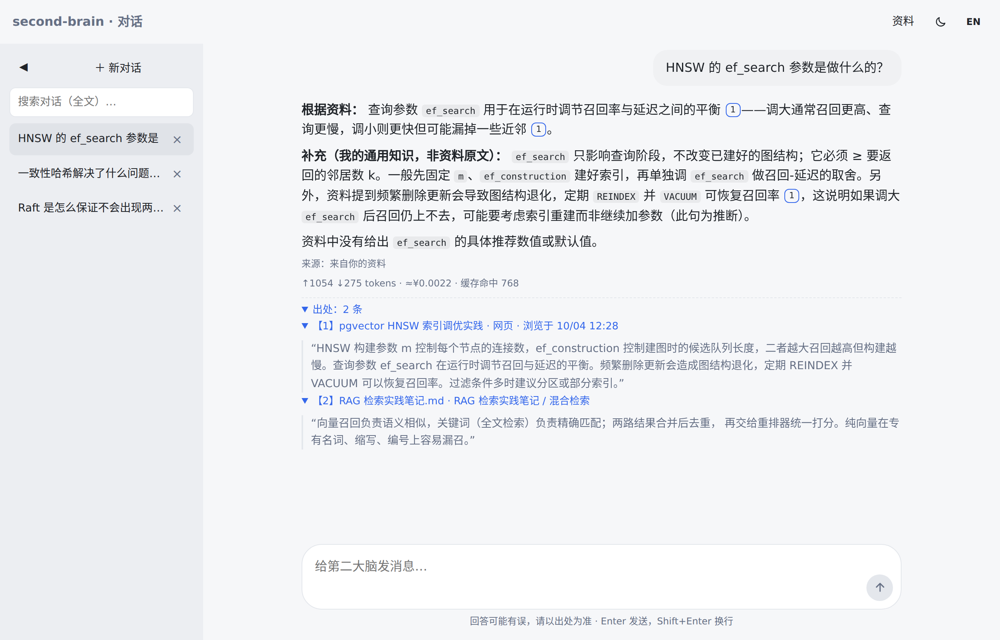
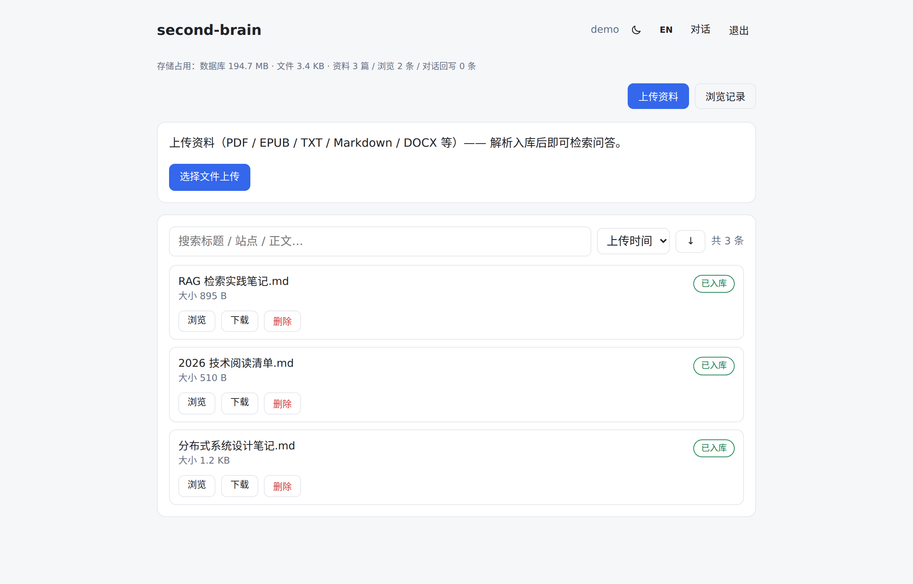
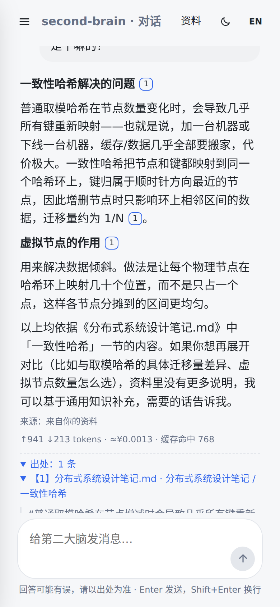
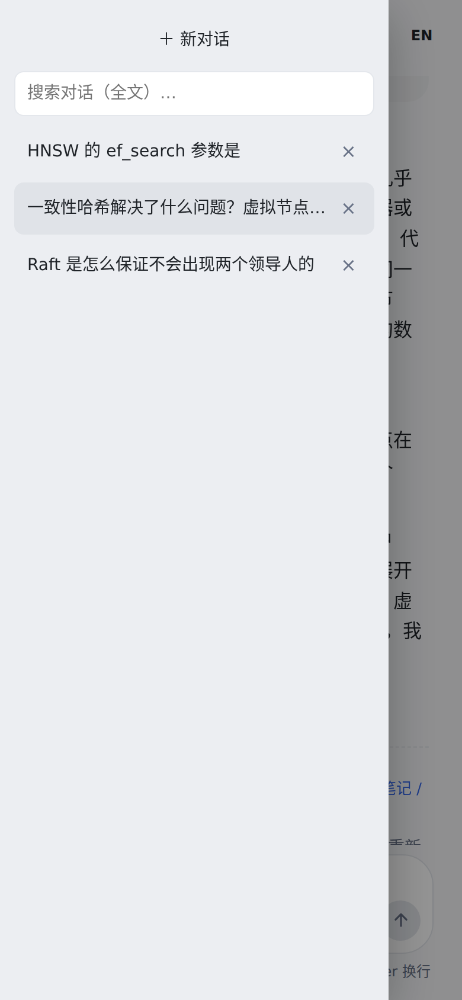
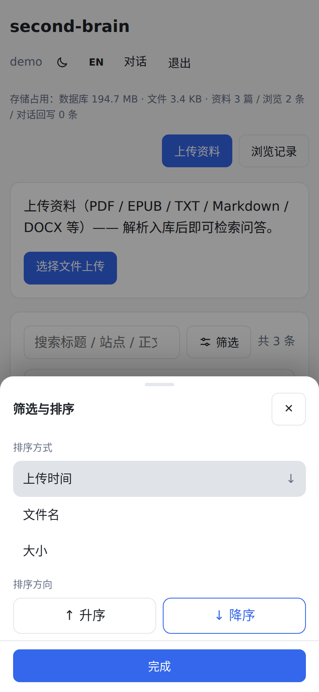

[English](README.md) | 中文

# second-brain · 个人第二大脑

> 浏览即入库、上传即入库的个人知识库：**采集 → 入库 → 检索问答 → 带出处回答**，单进程自托管，双端（Windows / Android）可用。

不是又一个聊天框——所有回答优先出自**你自己的资料与浏览记录**，每条结论附可点击的出处；
库外问题才交给模型兜底（可选联网），并把可复用的问答回写进库。



```text
┌─────────────┐   采集（阅读触发 + 快照）    ┌─────────────────┐
│ 浏览器扩展    │ ────────────────────────▶ │                 │
└─────────────┘                           │  FastAPI 单进程   │ ──▶ PostgreSQL + pgvector
┌─────────────┐   上传 PDF/EPUB/TXT/…     │  （API + PWA 托管）│       ├─ 向量 + 关键词 混合检索
│ PWA 双端     │ ◀────── 问答（SSE 流式）── │                 │       └─ cross-encoder 二段式重排
└─────────────┘                           └─────────────────┘
                                                  │
                                                  ├─▶ 云 LLM（deepseek-flash）· 云 Embedding（bge-m3）
                                                  ├─▶ Rerank（Qwen3-Reranker-4B）· 联网搜索（DeepSeek 服务端 / 自建 SearXNG）
```

## 能力总览

| 模块 | 能力 |
|------|------|
| **F1 核心问答** | 上传（PDF / EPUB / TXT / MD / DOCX）→ 解析分块 → 混合检索 → 带出处回答（正文 [N] 角标可跳原文）；模型兜底 + **LLM 判定的问答回写**（写前近似查重防重复） |
| **F2 浏览器采集** | 扩展按"阅读行为"自动采集（停留/滚动阈值）；单文件快照回放（CSP 沙箱隔离）；黑名单源头不采；断网排队重传 |
| **F3 MCP 接入** | 以 MCP（Streamable HTTP）把资料库接给 Claude Code 等 harness：检索 / 读文档 / 存笔记 |
| **F4 联网检索** | 库外问题可联网答题（默认 **DeepSeek 服务端搜索**；自建 SearXNG 免费可切换；付费源兜底默认关；按日限次护栏）；来源标注"来自网络"并附外链 |
| 阅读器 | EPUB 目录 / 页码（估算）/ 按页跳转 / 键盘翻页；PDF 内置预览；出处一键定位原文（PDF 页码 / 文本高亮 / EPUB CFI） |

检索链路的若干设计（评测驱动）：LLM 工具调用查询规划器（取代词表路由）、**二段式重排**（正确块分 0.79+ vs 噪声 ≤0.35，分离间隔 +0.643）、HNSW 维护流程、防编造回答守则——均留有调研与验收记录（见 `specs/`）。

## 界面

桌面端：资料库（上传与浏览双来源）



手机端（PWA——左上汉堡打开会话抽屉，筛选/预览为底部弹层）：

<p>
  
  
  
</p>

## 技术栈

| 层 | 选型 |
|----|------|
| 服务端 | Python 3.12 · FastAPI · SQLAlchemy(async) · Alembic |
| 存储 | PostgreSQL 16 + pgvector（HNSW）· pg_trgm；原文件按归属落盘 |
| 检索 | 向量召回 + 关键词加成 → cross-encoder 重排（硅基流动 Qwen3-Reranker-4B） |
| 模型 | 对话 deepseek-flash（V4，答案开思考档）· Embedding BAAI/bge-m3 · 联网 DeepSeek 服务端搜索（均可替换） |
| 前端 | Next.js 15（静态导出，由 FastAPI 同端口托管）· PWA 双端 |
| 采集 | Chrome MV3 扩展（esbuild + vitest） |
| 部署 | Docker（db）+ systemd + Caddy（见 `deploy/`）· 备份加密脚本 |

## 快速开始（本机）

前置：Python 3.12、Node ≥ 20、Docker、Chrome/Edge。

```bash
# 1. 数据库口令（compose 必填项；本机可留示例值，对外部署务必换随机值）
cp deploy/.env.example deploy/.env

# 2. 数据库（pgvector，映射 127.0.0.1:5433）
docker compose -f deploy/docker-compose.yml up -d db

# 3. 环境变量（复制模板，填入真实值；ADMIN_PASSWORD / SECRET_KEY 必须改，
#    仍为默认/弱值（SECRET_KEY <32 字符）时服务会 fail-closed 拒绝启动）
cp .env.example server/.env

# 4. 服务端
cd server
uv venv && uv pip install -e ".[dev]"     # 或常规 venv + pip
.venv/bin/alembic upgrade head
.venv/bin/uvicorn app.main:app --port 8000 --host 0.0.0.0     # 首次启动自动建管理员账号

# 5. 前端（静态导出到 web/out，由服务端同端口托管）
cd ../web && npm install && npm run build

# 6. 浏览器扩展（可选；dist/ 的加载与配置见下方「浏览器扩展」节）
cd ../extension && npm install && npm run build
```

> 提示：若把 `deploy/.env` 的 `POSTGRES_PASSWORD` 改成随机值，记得同步改 `server/.env` 的 `DATABASE_URL` 口令段（两处必须一致）。

打开 `http://localhost:8000`，用 `.env` 里的 `ADMIN_USERNAME / ADMIN_PASSWORD` 登录。

### 需要哪些 API Key？

| 变量 | 用途 | 必须？ | 去哪里拿 |
|---|---|---|---|
| `LLM_API_KEY` | 对话模型（DeepSeek）——**默认联网搜索**（服务端 web_search）复用同一账户，无需额外 key | ✅ | [platform.deepseek.com](https://platform.deepseek.com) → API keys（按量计费，个人用量约每月几元） |
| `EMBEDDING_API_KEY` | Embedding（硅基流动 bge-m3，免费）+ **重排**（Qwen3-Reranker，同一 key） | ✅ | [siliconflow.cn](https://siliconflow.cn) → API 密钥 |
| `ADMIN_PASSWORD` / `SECRET_KEY` | 登录口令 / 会话签名密钥 | ✅（启动 fail-closed 校验，默认/弱值拒绝启动） | 本地生成：`openssl rand -hex 32` |
| 联网搜索（可选替换） | 自建 SearXNG 零成本备选：`docker compose -f deploy/docker-compose.yml up -d searxng` 后设 `WEB_SEARCH_PROVIDER=searxng` | — | 无需 key |

两家都是 OpenAI 兼容 API——`LLM_BASE_URL` / `EMBEDDING_BASE_URL` 与模型名均可替换为任意兼容服务（如 OpenAI、其他厂商）。

### 浏览器扩展（Chrome / Edge，可选）

自动采集"你正在读的网页"（按停留/滚动阈值触发），源码在 `extension/`。三步：

1. **构建**

   ```bash
   cd extension && npm install && npm run build
   ```

2. **加载**：打开 `chrome://extensions`（Edge 为 `edge://extensions`）→ 打开右上角「开发者模式」→
   「加载已解压的扩展程序」→ 选择 `extension/dist` 目录。

3. **配置**（不配置不会采集）：
   - 先在应用里生成**采集凭据**：登录 → 资料页 → 「浏览器采集」卡片 → 采集凭据 → 新建（类型选「采集」）——
     凭据只显示一次，先复制保存；
   - 点扩展图标 → 打开设置页 → 填**服务器地址**与**采集凭据** → 「保存并测试」
     （会依次检查健康端点与采集端点）；
   - ⚠️ 安全设计：服务器地址仅接受 **https** 或**本机回环 http**（`http://localhost:8000` /
     `http://127.0.0.1:8000`）——明文公网/局域网 http 会被拒绝；对外部署请走 https（见 `deploy/`）。

日常控制：**扩展弹窗**可一键暂停（含队列深度/今日计数）；**设置页**可维护黑名单（这些站点永不采集）与触发阈值。凭据仅用于采集写入，可随时在应用内吊销。

## 测试与评测

```bash
# 单元测试（不依赖外部服务）
cd server && .venv/bin/pytest tests/ -q --ignore=tests/acceptance     # 168 项
cd extension && npm test                                              # 36 项

# 验收（需服务已启动；真实调用 LLM/Embedding）
cd server && .venv/bin/pytest tests/acceptance/ -q

# 质量评测（可重复、报告落盘）
.venv/bin/python tests/acceptance/sc002_eval.py       # 端到端答题：命中率/出处正确率
.venv/bin/python tests/acceptance/retrieval_eval.py   # 检索链对比：hit@6 / MRR / 分数分离间隔
```

## 目录结构

```text
server/     # FastAPI 服务端（app/ 业务 · tests/ 单测+验收+评测 · alembic/ 迁移）
web/        # Next.js 前端（静态导出，PWA）
extension/  # Chrome MV3 采集扩展
specs/      # ★ 项目文档（SDD）：每个 feature 的 spec / plan / tasks / research / contracts
deploy/     # 部署与备份（docker-compose / systemd / Caddy / 加密备份脚本）
.specify/   # spec-kit（SDD 工作流）配置、模板、项目档案（memory/project.md）
```

## 文档与工作流

本项目采用 **SDD（规格驱动开发）**：`specs/` 下的文档是事实源——需求在 `spec.md`，
决策与调研结论（含来源）在 `research.md`，实施与验收在 `tasks.md`，接口/数据模型各有契约。
代码变更必须对照同步文档（矩阵见 `.claude/CLAUDE.md`），工程纪律包括：

- **范式优先**：机制设计默认采用业界已验证方案，自研需举证（调研 → 征询 → 留痕）
- 开发在 feature 分支上进行（`001-core-qa` / `002-browser-capture` / `004-web-search` / `005-android-capture`；`main` 始终为最新）
- 里程碑后跑一次 `/speckit-analyze` 兜底审计

## 安全基线

私有部署（数据不出自租服务器；仅检索命中片段发往模型 API）：密码 argon2id ·
签名会话 + **纪元吊销**（登出全设备失效）· 登录**双键限速**（单账号 + IP 级）·
采集 Bearer 令牌（服务端只存哈希）· 快照回放强制 CSP 沙箱 · 读页出站 **SSRF 防护**
（内网地址拦截 / 重定向逐跳校验）· 默认/弱密钥 fail-closed 拒绝启动 · 备份加密（GPG AES-256）。

---

*私人项目 · 开发中（F1–F4 已可用，部署上线进行中）。详细状态见 `.specify/memory/project.md`。*
