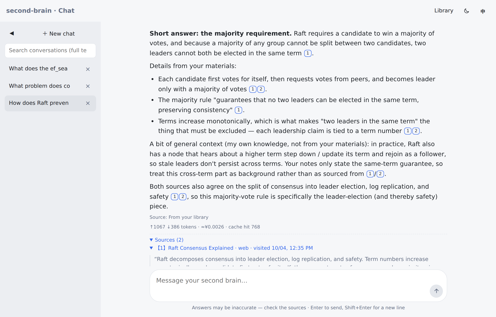
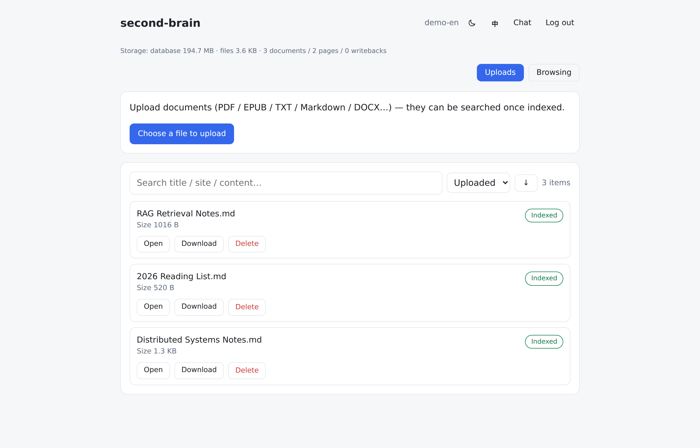
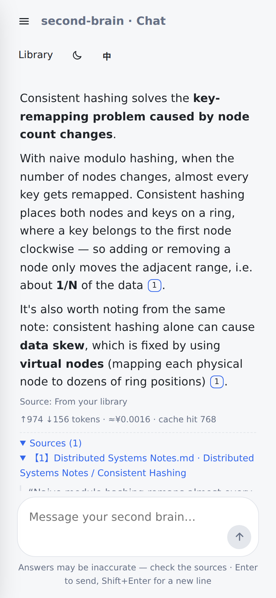
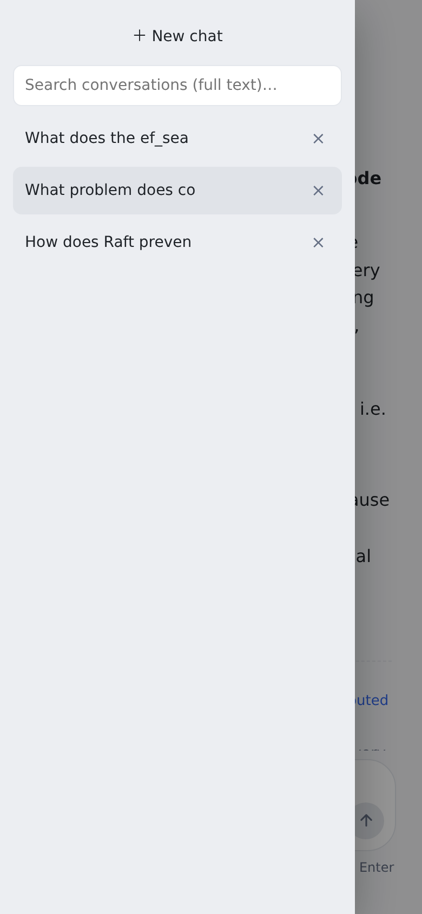
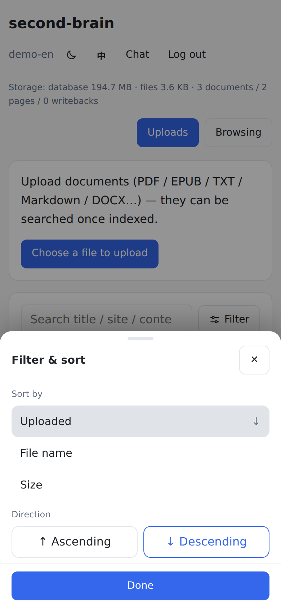

English | [中文](README.ch.md)

# second-brain · Your Personal Second Brain

> A self-hosted personal knowledge base where browsing and uploads flow straight in:
> **capture → ingest → retrieval Q&A → answers with citations**. Single process, usable on Windows / Android.

Not another chat box — answers come first from **your own documents and browsing history**,
every claim carries a clickable citation; only out-of-corpus questions fall back to the model
(optionally with web search), and reusable Q&As are written back into the library.



```text
┌─────────────┐   capture (reading-triggered + snapshot)   ┌─────────────────┐
│ Browser ext. │ ─────────────────────────────────────────▶ │                 │
└─────────────┘                                            │  FastAPI (single │ ──▶ PostgreSQL + pgvector
┌─────────────┐   upload PDF/EPUB/TXT/…                    │  process: API +  │       ├─ vector + keyword hybrid retrieval
│ PWA (2 ends) │ ◀──────────── streaming Q&A (SSE) ──────── │  PWA hosting)    │       └─ cross-encoder two-stage rerank
└─────────────┘                                            └─────────────────┘
                                                                   │
                                                                   ├─▶ Cloud LLM (deepseek-flash) · Cloud Embedding (bge-m3)
                                                                   ├─▶ Rerank (Qwen3-Reranker-4B) · Web search (DeepSeek server-side / self-hosted SearXNG)
```

## Capabilities

| Area | What it does |
|------|--------------|
| **F1 Core Q&A** | Upload (PDF / EPUB / TXT / MD / DOCX) → parse & chunk → hybrid retrieval → cited answers (inline `[N]` markers jump to the source); model fallback + **LLM-judged Q&A writeback** (with a near-duplicate pre-check) |
| **F2 Browser capture** | Extension auto-captures on reading behavior (dwell time / scroll depth); single-file snapshot replay (CSP-sandboxed); blocklisted sites never captured at the source; offline queue with retry |
| **F3 MCP access** | Exposes the library to Claude Code and other harnesses via MCP (Streamable HTTP): search / read document / save note |
| **F4 Web search** | Web-grounded answers for out-of-corpus questions (DeepSeek server-side search by default; self-hosted SearXNG as a free alternative; paid fallback off by default; daily cap as a guardrail); sources labeled "from the web" with external links; **links you paste into chat are read directly** (honest failure when unreachable — never guessed) |
| Reader | EPUB table of contents / page numbers (estimated) / jump-to-page / keyboard paging; built-in PDF preview; one-click source location (PDF page / text highlight / EPUB CFI) |

Retrieval-pipeline design (eval-driven): LLM tool-calling query planner (replacing wordlists),
**two-stage reranking** (correct chunks score 0.79+ vs. noise ≤ 0.35, separation margin +0.643),
HNSW maintenance routine, anti-fabrication answer rules — all backed by research and acceptance records (see `specs/`).

## Screenshots

Desktop — the library (uploads + browsing sources):



Mobile (PWA — hamburger opens the chat drawer; filters/previews are bottom sheets):

<p>
  
  
  
</p>

## Tech stack

| Layer | Choice |
|-------|--------|
| Backend | Python 3.12 · FastAPI · SQLAlchemy (async) · Alembic |
| Storage | PostgreSQL 16 + pgvector (HNSW) · pg_trgm; original files on disk, per-owner |
| Retrieval | Vector recall + keyword boost → cross-encoder rerank (SiliconFlow Qwen3-Reranker-4B) |
| Models | Chat: deepseek-flash (V4, thinking on for answers) · Embedding: BAAI/bge-m3 · Web search: DeepSeek server-side (all swappable) |
| Frontend | Next.js 15 (static export, served by FastAPI on the same port) · PWA for both ends |
| Capture | Chrome MV3 extension (esbuild + vitest) |
| Deployment | Docker (db) + systemd + Caddy (see `deploy/`) · encrypted backup scripts |

## Quick start (local)

Prerequisites: Python 3.12, Node ≥ 20, Docker, Chrome/Edge.

```bash
# 1. Database credentials (required by compose; keep the sample values locally,
#    switch to random ones for any non-local deployment)
cp deploy/.env.example deploy/.env

# 2. Database (pgvector, bound to 127.0.0.1:5433)
docker compose -f deploy/docker-compose.yml up -d db

# 3. Environment (copy the template and fill in real values; ADMIN_PASSWORD / SECRET_KEY
#    are required — the server refuses to boot (fail-closed) while they are default
#    or too weak (SECRET_KEY < 32 chars))
cp .env.example server/.env

# 4. Server
cd server
uv venv && uv pip install -e ".[dev]"     # or a plain venv + pip
.venv/bin/alembic upgrade head
.venv/bin/uvicorn app.main:app --port 8000 --host 0.0.0.0     # first boot creates the admin account

# 5. Frontend (static export to web/out, served by the server on the same port)
cd ../web && npm install && npm run build

# 6. Browser extension (optional; loading & configuration in "Browser extension" below)
cd ../extension && npm install && npm run build
```

> Note: if you change `POSTGRES_PASSWORD` in `deploy/.env`, update the password part of `DATABASE_URL` in `server/.env` to match (the two must agree).

Open `http://localhost:8000` and log in with `ADMIN_USERNAME / ADMIN_PASSWORD` from `.env`.

### Which API keys do I need?

| Variable | Used for | Required? | Where to get it |
|---|---|---|---|
| `LLM_API_KEY` | Chat model (DeepSeek) — the **default web search** (server-side `web_search`) reuses the same account, no extra key | ✅ | [platform.deepseek.com](https://platform.deepseek.com) → API keys (pay-as-you-go, a few dollars/month for personal use) |
| `EMBEDDING_API_KEY` | Embeddings (SiliconFlow bge-m3, free) + **reranking** (Qwen3-Reranker, same key) | ✅ | [siliconflow.cn](https://siliconflow.cn) → API keys |
| `ADMIN_PASSWORD` / `SECRET_KEY` | Login password / session-signing secret | ✅ (fail-closed: the server refuses to boot on default or weak values) | Generate locally: `openssl rand -hex 32` |
| Web search (optional swap) | Self-hosted SearXNG as a zero-cost alternative: `docker compose -f deploy/docker-compose.yml up -d searxng`, then set `WEB_SEARCH_PROVIDER=searxng` | — | no key needed |

Both providers are OpenAI-compatible — `LLM_BASE_URL` / `EMBEDDING_BASE_URL` and the model names can be swapped for any compatible service (OpenAI, other vendors).

### Browser extension (Chrome / Edge, optional)

Captures the pages you actually read (triggered by dwell-time / scroll-depth thresholds). Source in `extension/` — three steps:

1. **Build**

   ```bash
   cd extension && npm install && npm run build
   ```

2. **Load**: open `chrome://extensions` (Edge: `edge://extensions`) → enable "Developer mode" (top right) →
   "Load unpacked" → select the `extension/dist` directory.

3. **Configure** (nothing is captured until configured):
   - First create a **capture token** in the app: log in → Library → the "Browser capture" card →
     capture tokens → create one with the "capture" scope. The token is shown **once** — copy it first;
   - Click the extension icon → open its options page → enter the **server URL** and the **capture token** →
     "Save & test" (checks the health endpoint, then the capture endpoint);
   - ⚠️ Security by design: the server URL must be **https** or **loopback http** (`http://localhost:8000` /
     `http://127.0.0.1:8000`) — plain http over a public/LAN address is rejected; deploy behind https (see `deploy/`).

Day-to-day: the **popup** shows pause/queue/today's count (one-click pause); the **options page** manages the
blocklist (sites never captured) and trigger thresholds. Tokens are write-scoped and revocable anytime in the app.

## Tests & evals

```bash
# Unit tests (no external services required)
cd server && .venv/bin/pytest tests/ -q --ignore=tests/acceptance     # 168 tests
cd extension && npm test                                              # 36 tests

# Acceptance (server must be running; calls real LLM/Embedding APIs)
cd server && .venv/bin/pytest tests/acceptance/ -q

# Quality evals (repeatable, reports written to disk)
.venv/bin/python tests/acceptance/sc002_eval.py       # end-to-end Q&A: hit rate / citation accuracy
.venv/bin/python tests/acceptance/retrieval_eval.py   # retrieval comparison: hit@6 / MRR / score separation
```

## Repository layout

```text
server/     # FastAPI backend (app/ business logic · tests/ unit+acceptance+eval · alembic/ migrations)
web/        # Next.js frontend (static export, PWA)
extension/  # Chrome MV3 capture extension
specs/      # ★ Project documentation (SDD): spec / plan / tasks / research / contracts per feature
deploy/     # Deployment & backup (docker-compose / systemd / Caddy / encrypted backup scripts)
.specify/   # spec-kit (SDD workflow) config, templates, project charter (memory/project.md)
```

## Docs & workflow

This project follows **SDD (spec-driven development)**: the documents under `specs/` are the
source of truth — requirements in `spec.md`, decisions and research (with sources) in
`research.md`, implementation and acceptance in `tasks.md`, interfaces and data models in
dedicated contracts. Code changes must keep documents in sync (matrix in `.claude/CLAUDE.md`).
Engineering discipline includes:

- **Paradigm-first**: mechanism design defaults to industry-proven approaches; anything
  home-grown must be justified (research → consult → record)
- Development happens on feature branches (`001-core-qa` / `002-browser-capture` /
  `004-web-search` / `005-android-capture`; `main` is always current)
- A `/speckit-analyze` audit after each milestone

## Security baseline

Private deployment (data stays on your own server; only retrieved snippets go to model APIs):
argon2id passwords · signed sessions with **epoch revocation** (logout invalidates all devices) ·
**dual-key login rate limiting** (per-account + per-IP) · capture bearer tokens (the server stores
hashes only) · snapshot replay forced into a CSP sandbox · **SSRF-guarded page reader** (private
addresses blocked, per-hop redirect validation) · fail-closed boot while secrets are default or
weak · encrypted backups (GPG AES-256).

## License

[MIT](LICENSE)

---

*Personal project, in active development (F1–F4 usable; production rollout in progress).
Detailed status in `.specify/memory/project.md`.*
